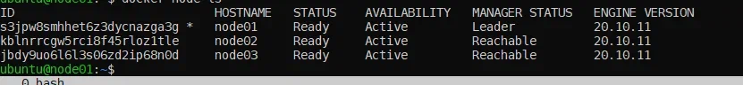
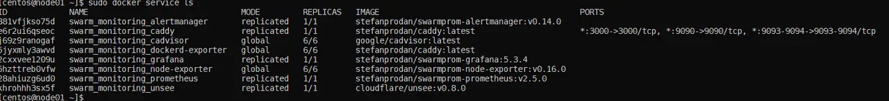

## Домашнее задание к занятию "5.5. Оркестрация кластером Docker контейнеров на примере Docker Swarm"
#### link to homework: https://github.com/netology-code/virt-homeworks/tree/virt-11/05-virt-05-docker-swarm

1. Ответы на вопросы:
* _В чём отличие режимов работы сервисов в Docker Swarm кластере: replication и global?_  
 **Ответ:** Replicated - одна задача с общим контентом реплицированная на одну или несколько нод, например веб приложение.   
Global - одна независимая но одинаковая задача на все ноды кластера, например агент мониторинга
* _Какой алгоритм выбора лидера используется в Docker Swarm кластере?_ **Ответ:** Алгоритм Raft
* Что такое Overlay Network? Overlay сети используются для обмена трафиком между множеством демонов докера на разных хостах, по умолчанию в зашифрованном виде.

2.   

3. 
