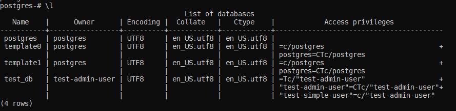
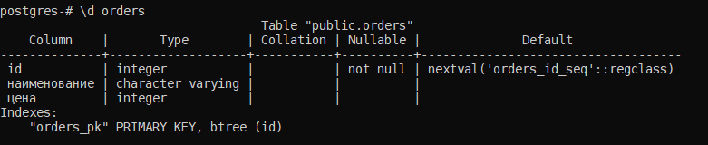
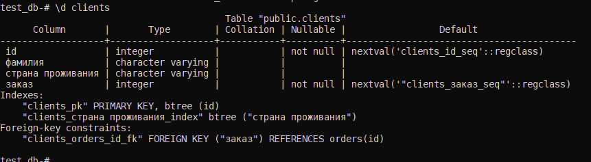
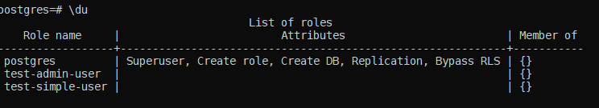
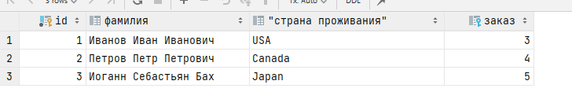

## Домашнее задание к занятию "Домашнее задание к занятию "6.2. SQL""
#### link to homework: https://github.com/netology-code/virt-homeworks/tree/master/06-db-02-sql

1. docker-compose:
```yaml
version: "3.3"

networks:
  net:
    driver: bridge

services:
  postgresql:
    restart: unless-stopped
    image: postgres:12.0
    environment:
      POSTGRES_HOST_AUTH_METHOD: "trust"
    volumes:
      - '/opt/postgres_data:/var/lib/postgresql/data'
      - '/opt/postgres_backups:/var/lib/postgresql/backups'
    ports:
      - '5432:5432'
    networks:
      - net

```

2. 
* Список баз:  

* Описание таблиц:   


* запрос для выдачи списка пользователей  
```sql
   SELECT grantee, privilege_type, table_name
FROM information_schema.role_table_grants
WHERE table_name in ('orders','clients')
```
* список пользователей с правами над таблицами test_db   


3. Наполнение тестовыми данными и выдача результатов:  
```sql
select count(*) from clients; --result: 5 
select count(*) from orders;  --result: 5 
```

4. 
```sql
update clients
set заказ = (select id from orders where наименование = 'Книга')
where фамилия = 'Иванов Иван Иванович';
update clients
set заказ = (select id from orders where наименование = 'Монитор')
where фамилия = 'Петров Петр Петрович';
update clients
set заказ = (select id from orders where наименование = 'Гитара')
where фамилия = 'Иоганн Себастьян Бах';
```
```sql
select * from clients where заказ is not null;
```


5. EXPLAIN выводит план запроса.  

```text
Seq Scan on clients  (cost=0.00..18.10 rows=806 width=72)
  Filter: ("заказ" IS NOT NULL)
```

Т.к таблица маленькая, используется Seq scan - простой перебор строк с фильтрацией.  

cost - оценка "стоимости" выполнения запроса. Первое значение: до вывода результата (например сортировка). Второе значение: оценка общей стоимости выполнения запроса  
rows - оценка количество строк в таблице   
width - оценка средней длина в байтах значений в колонке   
несмотря на то что записей всего 5 показывает что rows=806. (Нужно выполнить ANALYZE чтоб обнвоить данные выбора лучшего плана запроса)  

6. Дамп и восстановление
```bash
pg_dump --username=postgres --host=127.0.0.1 --port=5432 --verbose -Fc -f /opt/postgres_backup/backup.backup test_db
pg_restore --host 127.0.0.1 --port 5432 -U postgres -d test_db --verbose --clean /opt/postgres_backup/backup.backup
``