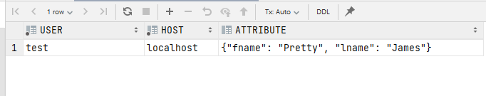
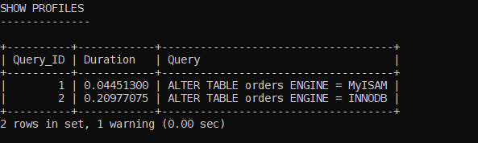

## Домашнее задание к занятию Домашнее задание к занятию "6.3. MySQL"
#### link to homework: https://github.com/netology-code/virt-homeworks/tree/master/06-db-03-mysql

1. Версия сервера:
```text
mysql  Ver 8.0.27-0ubuntu0.20.04.1 for Linux on x86_64 ((Ubuntu))

Connection id:          14
Current database:
Current user:           root@172.18.0.1
SSL:                    Cipher in use is TLS_AES_256_GCM_SHA384
Current pager:          stdout
Using outfile:          ''
Using delimiter:        ;
Server version:         8.0.28 MySQL Community Server - GPL
Protocol version:       10
Connection:             127.0.0.1 via TCP/IP
Server characterset:    utf8mb4
Db     characterset:    utf8mb4
Client characterset:    utf8mb4
Conn.  characterset:    utf8mb4
TCP port:               3306
Binary data as:         Hexadecimal
Uptime:                 4 min 45 sec

Threads: 2  Questions: 46  Slow queries: 0  Opens: 155  Flush tables: 3  Open tables: 73  Queries per second avg: 0.161
```

**Одна запись "My little pony" с price > 300**

2. Данные по пользователю test  


3. Используется InnoDB   


4.
```text
# Copyright (c) 2017, Oracle and/or its affiliates. All rights reserved.
#
# This program is free software; you can redistribute it and/or modify
# it under the terms of the GNU General Public License as published by
# the Free Software Foundation; version 2 of the License.
#
# This program is distributed in the hope that it will be useful,
# but WITHOUT ANY WARRANTY; without even the implied warranty of
# MERCHANTABILITY or FITNESS FOR A PARTICULAR PURPOSE.  See the
# GNU General Public License for more details.
#
# You should have received a copy of the GNU General Public License
# along with this program; if not, write to the Free Software
# Foundation, Inc., 51 Franklin St, Fifth Floor, Boston, MA  02110-1301 USA

#
# The MySQL  Server configuration file.
#
# For explanations see
# http://dev.mysql.com/doc/mysql/en/server-system-variables.html

[mysqld]
pid-file        = /var/run/mysqld/mysqld.pid
socket          = /var/run/mysqld/mysqld.sock
datadir         = /var/lib/mysql
secure-file-priv= NULL

# Custom config should go here
!includedir /etc/mysql/conf.d/

innodb_buffer_pool_size = 1228M
innodb_log_file_size = 100M
innodb_log_buffer_size = 1M
innodb_file_per_table
innodb_flush_method = O_DSYNC
``