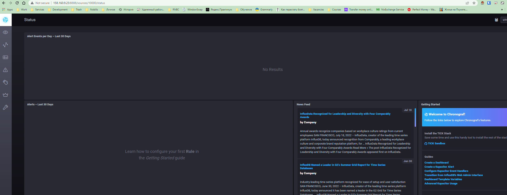
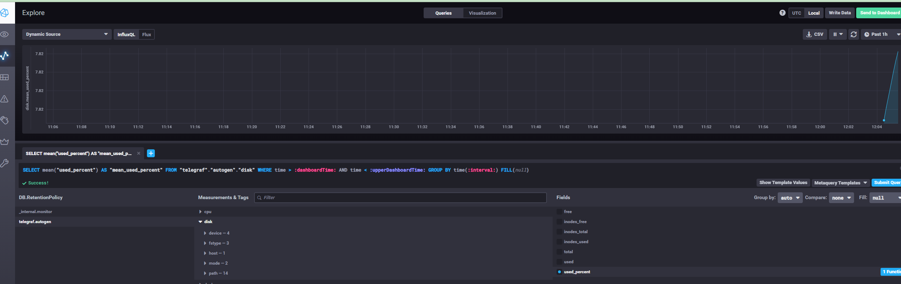
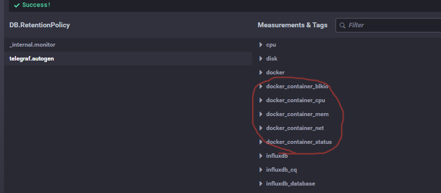

## [Домашнее задание к занятию "10.02. Системы мониторинга"](https://github.com/netology-code/mnt-homeworks/tree/master/10-monitoring-02-systems)
## 

1. **Вопрос:** Опишите основные плюсы и минусы pull и push систем мониторинга.  
**Ответ**:
Плюсы были в презентации. Поэтому чтоб не повторяться и не перепечатывать напишу минусы:  
Pull модель:   
а) Нельзя просто настроить для закрытого контура, когда сервер мониторинга "снаружи" него (Нужно разворачивать дополнительные прокси)  
б) TCP вместо возможного более быстрого UDP  
Push модель:   
а) В теории может задидосить сервер при достаточно большом количестве агентов.  
б) Осуствие централизованного контроля за агентами, данные могут слать, уже забытые, не нужные или неизвестные агенты.
в) Отсутствие возможности курлом достать данные с агента.

2. **Вопрос**: Какие из ниже перечисленных систем относятся к push модели, а какие к pull? А может есть гибридные?

Prometheus - pull
TICK - push
Zabbix - push, pull
VictoriaMetrics - push, pull
Nagios - push

3. Запущен TICK. Вывод curl:    
curl http://localhost:8086/ping - без вывода. HTTP/1.1 204 No Content  
curl http://localhost:9092/kapacitor/v1/ping - без вывода. HTTP/1.1 204 No Content  
curl http://localhost:8888  :
```html
<!DOCTYPE html><html><head><meta http-equiv="Content-type" content="text/html; charset=utf-8"><title>Chronograf</title><link rel="icon shortcut" href="/favicon.fa749080.ico"><link rel="stylesheet" href="/src.9cea3e4e.css"></head><body> <div id="react-root" data-basepath=""></div> <script src="/src.a969287c.js"></script> </body></html>
```


4. Утилизация места на диске

На момент выполнения задания интерфейс хронографа уже изменился и в нем я не нашел как вывести информацию о утилизации диска сразу после установки.  
Однако, нашел список inputs (https://github.com/influxdata/telegraf/tree/master/plugins/inputs), добавил в конфиг телеграфа [[inputs.disk]] чтобы добавить такую возможность. В итоге следующий конфиг файл:

```text
[agent]
  interval = "5s"
  round_interval = true
  metric_batch_size = 1000
  metric_buffer_limit = 10000
  collection_jitter = "0s"
  flush_interval = "5s"
  flush_jitter = "0s"
  precision = ""
  debug = false
  quiet = false
  logfile = ""
  hostname = "$HOSTNAME"
  omit_hostname = false

[[outputs.influxdb]]
  urls = ["http://influxdb:8086"]
  database = "telegraf"
  username = ""
  password = ""
  retention_policy = ""
  write_consistency = "any"
  timeout = "5s"

[[inputs.docker]]
  endpoint = "unix:///var/run/docker.sock"
  container_names = []
  timeout = "5s"
  perdevice = true
  total = false

[[inputs.disk]]
  ## By default stats will be gathered for all mount points.
  ## Set mount_points will restrict the stats to only the specified mount points.
  #mount_points = ["/"]

[[inputs.cpu]]
[[inputs.system]]
[[inputs.influxdb]]
  urls = ["http://influxdb:8086/debug/vars"]
[[inputs.syslog]]
#   ## Specify an ip or hostname with port - eg., tcp://localhost:6514, tcp://10.0.0.1:6514
#   ## Protocol, address and port to host the syslog receiver.
#   ## If no host is specified, then localhost is used.
#   ## If no port is specified, 6514 is used (RFC5425#section-4.1).
  server = "tcp://localhost:6514"
```
Соотвественно в интерфейсе хронографа появилась возхможность строить графики по дискам:  



5. Добавить docker inputs.

Как видно на вышеприведенном конфиге : inputs.docker уже пристсвует в поставке по умолчанию. Для этого ничего не пришлось делать.  
Measurments уже присуствуют в интерфейсе хронографа:  
