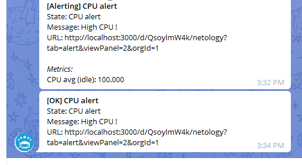

## [Домашнее задание к занятию "10.03. Grafana"](https://github.com/netology-code/mnt-homeworks/tree/master/10-monitoring-03-grafana)
## 

1. Задание 1  


2. Задание 2  

Panels:  

```shell
#Утилизация CPU для nodeexporter (в процентах, 100-idle) 
100 - (avg by (instance) (rate(node_cpu_seconds_total{job="nodeexporter",mode="idle"}[1m])) * 100)
#CPULA 1/5/15
node_load1{job="nodeexporter"}, node_load5{job="nodeexporter"},node_load15{job="nodeexporter"}
#Количество свободной оперативной памяти
node_memory_MemFree_bytes{job="nodeexporter"}, node_memory_MemTotal_bytes{job="nodeexporter"}
#Количество места на файловой системе
node_filesystem_avail_bytes{job="nodeexporter",mountpoint="/"}, node_filesystem_size_bytes{job="nodeexporter",mountpoint="/"}
```


3. Настройка алертов

Создал правила на CPU, Mem и диски.  

Нагрузил систему по CPU:
```shell
sudo stress --cpu 2 -v --timeout 300s
```


Сработало оповещение в телеграм:  



4. JSON

[Ссылка на конфигурацию дашборда в графане](grafana.json)