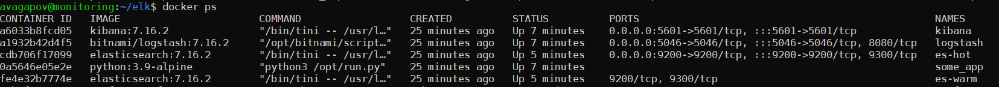
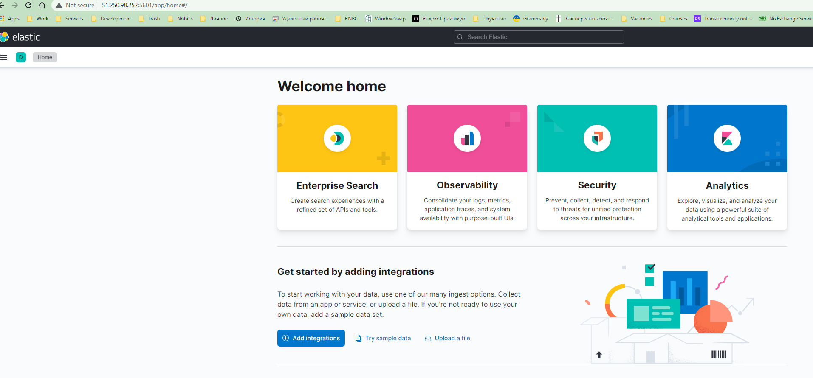
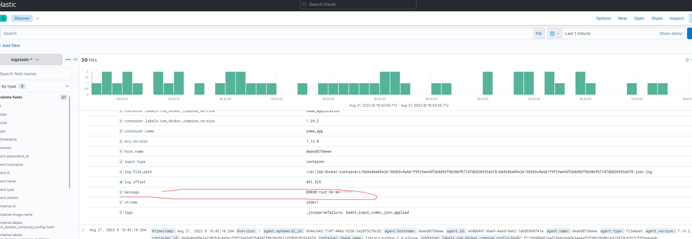
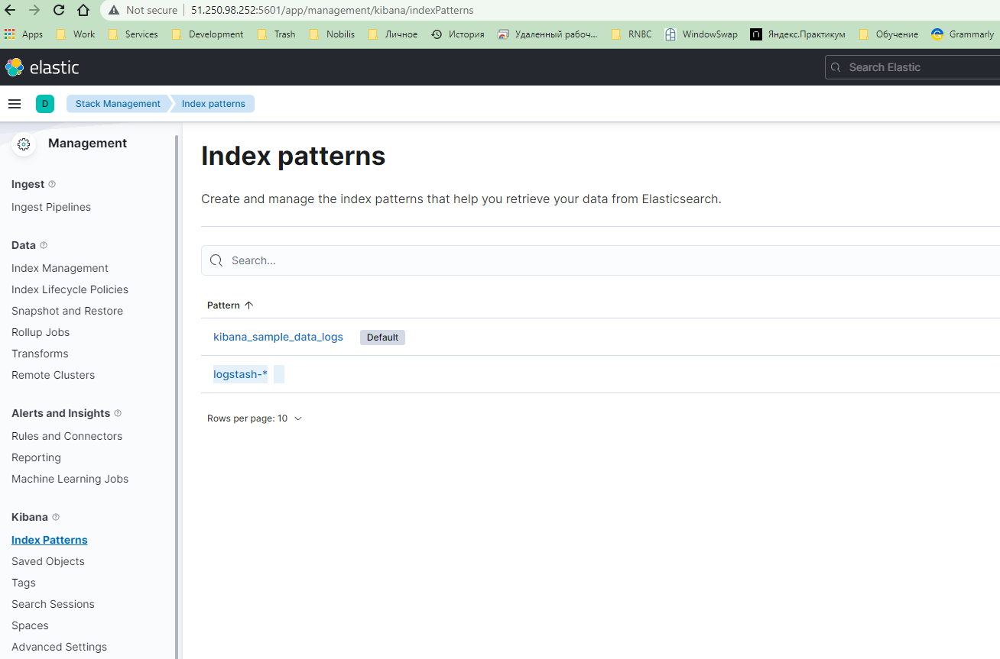

## [Домашнее задание к занятию "10.04. ELK"](https://github.com/netology-code/mnt-homeworks/tree/master/10-monitoring-04-elk)
## 

1. Задание 1

Для выполнения задания, использовал docker-compose в help (по ходу курса мы его уже разворачивали минимум два раза самостоятельно)    
При поднятии эластик не запускался. Исправилось командой "sysctl -w vm.max_map_count=262144"  

Скриншот docker ps через 5 минут:  


Скриншот Kibana:  


2. Задание 2  

В конфиге logstash.conf ошибка
```shell
...
input {
  tcp { # в таком виде логи в кибану залетают с кривой кодировкой, нужно поменять на beats
    port => 5046
    codec => json
  }
}
.....
index => "logstash-%{[@metadata][indexDate]}" # в таком виде логстешщ отказывался создавать индекс, изза lowercase, заменил на index => "logstash-%{+YYYY.MM.dd}"
....
```

После замены конфига и добавления index pattern logstash-* , в кибане отразились корректные логи:  
  
