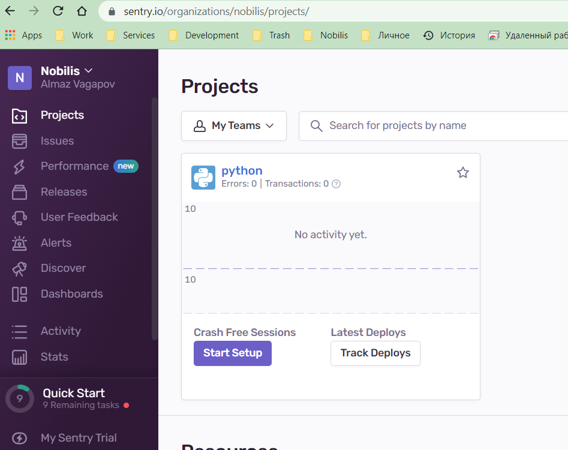
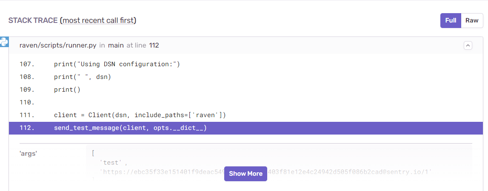
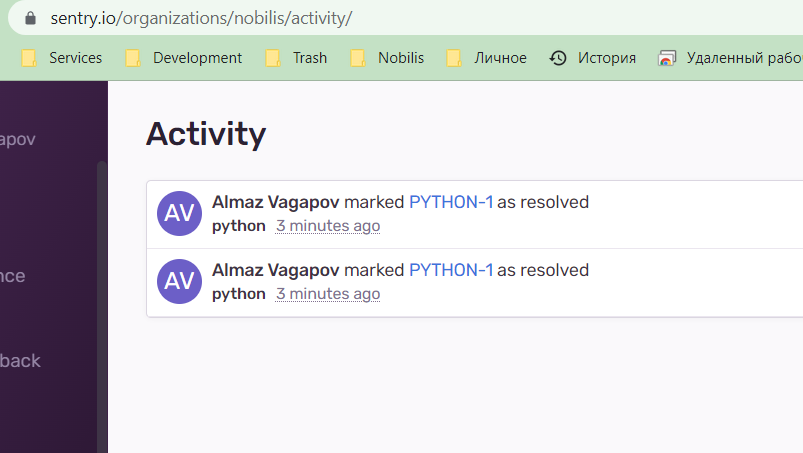
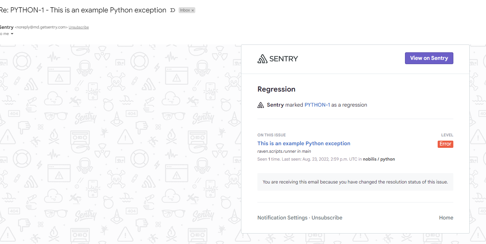

## [Домашнее задание к занятию "10.05. Sentry"](https://github.com/netology-code/mnt-homeworks/tree/master/10-monitoring-05-sentry)
## 

1. Задание 1.

sentry.io

2. Задание 2  

Stack trace:  

Activity:  

3. Задание 3  
Alert:  
