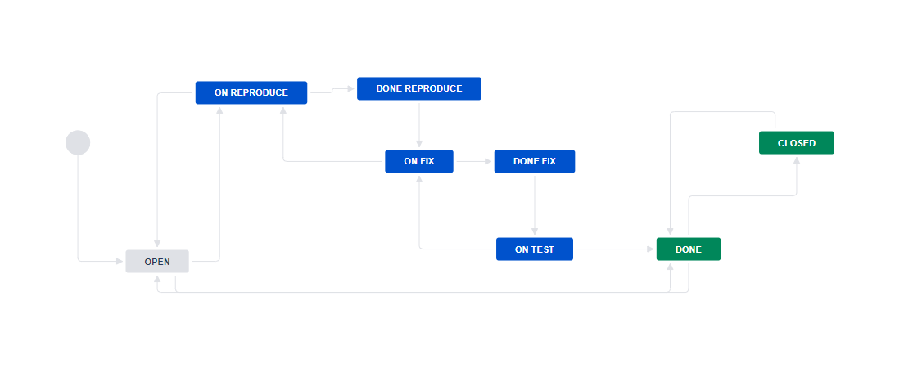
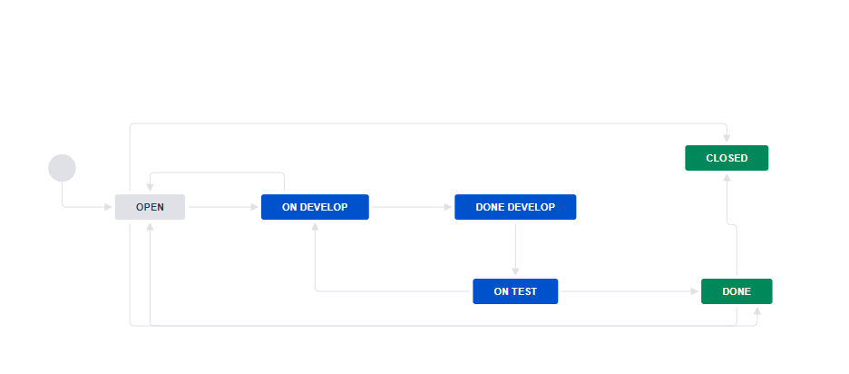

## [Домашнее задание к занятию "09.01 Жизненный цикл ПО"](https://github.com/netology-code/mnt-homeworks/tree/master/09-ci-01-intro)
## 

## Основная часть

1. Workflow для багов  

2. Workflow для других типов задач  
