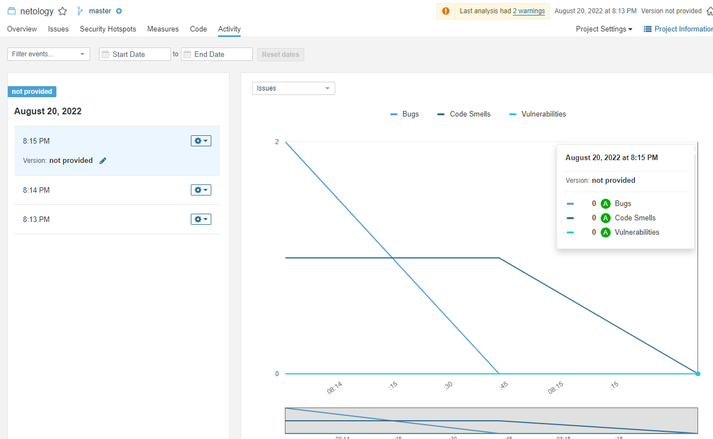

## [Домашнее задание к занятию "09.03 CI\CD"](https://github.com/netology-code/mnt-homeworks/tree/MNT-7/09-ci-03-cicd)
## 

## Знакомоство с SonarQube

Успешный тест:  
```shell

INFO: Scanner configuration file: /home/avagapov/netology/netology.lessons/Lessons3/3-9(CICD)/09-ci-03-cicd/infrastructure/sonar/sonar-scanner-4.7.0.2747-linux/conf/sonar-scanner.properties
INFO: Project root configuration file: NONE
INFO: SonarScanner 4.7.0.2747
INFO: Java 11.0.14.1 Eclipse Adoptium (64-bit)
INFO: Linux 5.10.60.1-microsoft-standard-WSL2 amd64
INFO: User cache: /home/avagapov/.sonar/cache
INFO: Scanner configuration file: /home/avagapov/netology/netology.lessons/Lessons3/3-9(CICD)/09-ci-03-cicd/infrastructure/sonar/sonar-scanner-4.7.0.2747-linux/conf/sonar-scanner.properties
INFO: Project root configuration file: NONE
INFO: Analyzing on SonarQube server 9.1.0
INFO: Default locale: "en", source code encoding: "UTF-8" (analysis is platform dependent)
INFO: Load global settings
INFO: Load global settings (done) | time=591ms
INFO: Server id: 9CFC3560-AYK8JDRwFxAc9yj6nggr
INFO: User cache: /home/avagapov/.sonar/cache
INFO: Load/download plugins
INFO: Load plugins index
INFO: Load plugins index (done) | time=291ms
INFO: Load/download plugins (done) | time=340ms
INFO: Process project properties
INFO: Process project properties (done) | time=7ms
INFO: Execute project builders
INFO: Execute project builders (done) | time=1ms
INFO: Project key: netology
INFO: Base dir: /home/avagapov/netology/netology.lessons/Lessons3/3-9(CICD)/09-ci-03-cicd/example
INFO: Working dir: /home/avagapov/netology/netology.lessons/Lessons3/3-9(CICD)/09-ci-03-cicd/example/.scannerwork
INFO: Load project settings for component key: 'netology'
INFO: Load project settings for component key: 'netology' (done) | time=272ms
INFO: Load quality profiles
INFO: Load quality profiles (done) | time=309ms
INFO: Load active rules
INFO: Load active rules (done) | time=5434ms
INFO: Indexing files...
INFO: Project configuration:
INFO:   Excluded sources for coverage: fail.py
INFO: 1 file indexed
INFO: 0 files ignored because of scm ignore settings
INFO: Quality profile for py: Sonar way
INFO: ------------- Run sensors on module netology
INFO: Load metrics repository
INFO: Load metrics repository (done) | time=281ms
INFO: Sensor Python Sensor [python]
WARN: Your code is analyzed as compatible with python 2 and 3 by default. This will prevent the detection of issues specific to python 2 or python 3. You can get a more precise analysis by setting a python version in your configuration via the parameter "sonar.python.version"
INFO: Starting global symbols computation
INFO: 1 source file to be analyzed
INFO: Load project repositories
INFO: Load project repositories (done) | time=266ms
INFO: 1/1 source file has been analyzed
INFO: Starting rules execution
INFO: 1 source file to be analyzed
INFO: 1/1 source file has been analyzed
INFO: Sensor Python Sensor [python] (done) | time=686ms
INFO: Sensor Cobertura Sensor for Python coverage [python]
INFO: Sensor Cobertura Sensor for Python coverage [python] (done) | time=12ms
INFO: Sensor PythonXUnitSensor [python]
INFO: Sensor PythonXUnitSensor [python] (done) | time=1ms
INFO: Sensor CSS Rules [cssfamily]
INFO: No CSS, PHP, HTML or VueJS files are found in the project. CSS analysis is skipped.
INFO: Sensor CSS Rules [cssfamily] (done) | time=1ms
INFO: Sensor JaCoCo XML Report Importer [jacoco]
INFO: 'sonar.coverage.jacoco.xmlReportPaths' is not defined. Using default locations: target/site/jacoco/jacoco.xml,target/site/jacoco-it/jacoco.xml,build/reports/jacoco/test/jacocoTestReport.xml
INFO: No report imported, no coverage information will be imported by JaCoCo XML Report Importer
INFO: Sensor JaCoCo XML Report Importer [jacoco] (done) | time=3ms
INFO: Sensor C# Project Type Information [csharp]
INFO: Sensor C# Project Type Information [csharp] (done) | time=2ms
INFO: Sensor C# Analysis Log [csharp]
INFO: Sensor C# Analysis Log [csharp] (done) | time=19ms
INFO: Sensor C# Properties [csharp]
INFO: Sensor C# Properties [csharp] (done) | time=0ms
INFO: Sensor JavaXmlSensor [java]
INFO: Sensor JavaXmlSensor [java] (done) | time=1ms
INFO: Sensor HTML [web]
INFO: Sensor HTML [web] (done) | time=3ms
INFO: Sensor VB.NET Project Type Information [vbnet]
INFO: Sensor VB.NET Project Type Information [vbnet] (done) | time=1ms
INFO: Sensor VB.NET Analysis Log [vbnet]
INFO: Sensor VB.NET Analysis Log [vbnet] (done) | time=17ms
INFO: Sensor VB.NET Properties [vbnet]
INFO: Sensor VB.NET Properties [vbnet] (done) | time=0ms
INFO: ------------- Run sensors on project
INFO: Sensor Zero Coverage Sensor
INFO: Sensor Zero Coverage Sensor (done) | time=1ms
INFO: SCM Publisher SCM provider for this project is: git
INFO: SCM Publisher 1 source file to be analyzed
INFO: SCM Publisher 0/1 source files have been analyzed (done) | time=57ms
WARN: Missing blame information for the following files:
WARN:   * fail.py
WARN: This may lead to missing/broken features in SonarQube
INFO: CPD Executor Calculating CPD for 1 file
INFO: CPD Executor CPD calculation finished (done) | time=10ms
INFO: Analysis report generated in 69ms, dir size=103.0 kB
INFO: Analysis report compressed in 17ms, zip size=14.0 kB
INFO: Analysis report uploaded in 527ms
INFO: ANALYSIS SUCCESSFUL, you can browse http://51.250.10.13:9000/dashboard?id=netology
INFO: Note that you will be able to access the updated dashboard once the server has processed the submitted analysis report
INFO: More about the report processing at http://51.250.10.13:9000/api/ce/task?id=AYK8QO6TFxAc9yj6nll0
INFO: Analysis total time: 9.300 s
INFO: ------------------------------------------------------------------------
INFO: EXECUTION SUCCESS
INFO: ------------------------------------------------------------------------
INFO: Total time: 11.433s
INFO: Final Memory: 8M/40M
INFO: ------------------------------------------------------------------------
```



## Знакомство с Nexus

Ссылка на файл:
[maven-metadata.xml](maven-metadata.xml)

## Знакомство с Maven

```shell
$ mvn --vserion
Apache Maven 3.8.6 (84538c9988a25aec085021c365c560670ad80f63)
Maven home: /home/avagapov/netology/netology.lessons/Lessons3/3-9(CICD)/maven/apache-maven-3.8.6
Java version: 17.0.4, vendor: Private Build, runtime: /usr/lib/jvm/java-17-openjdk-amd64
Default locale: en, platform encoding: UTF-8
OS name: "linux", version: "5.10.60.1-microsoft-standard-wsl2", arch: "amd64", family: "unix"
```

Ссылка на файл:
[pom.xml](pom.xml)