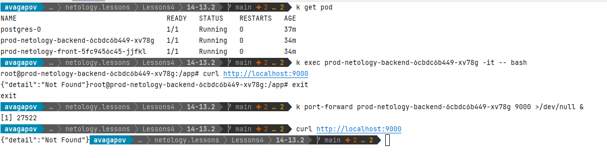
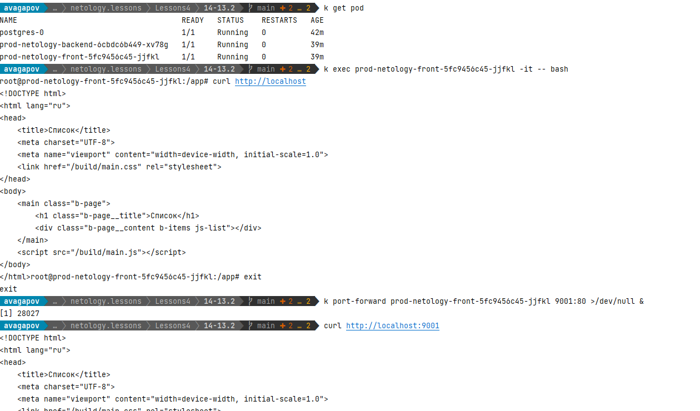
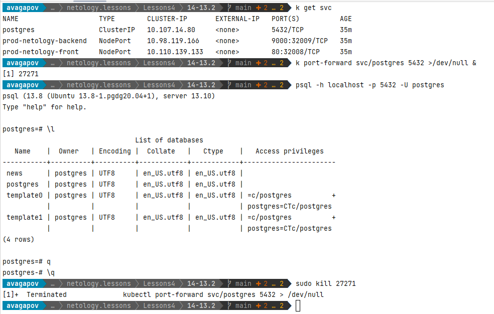
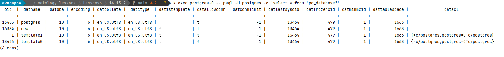
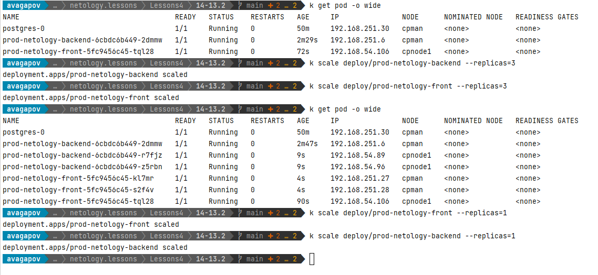

## [Домашнее задание к занятию "13.3 работа с kubectl"](https://github.com/netology-code/devkub-homeworks/blob/main/13-kubernetes-config-03-kubectl.md#%D0%B4%D0%BE%D0%BC%D0%B0%D1%88%D0%BD%D0%B5%D0%B5-%D0%B7%D0%B0%D0%B4%D0%B0%D0%BD%D0%B8%D0%B5-%D0%BA-%D0%B7%D0%B0%D0%BD%D1%8F%D1%82%D0%B8%D1%8E-133-%D1%80%D0%B0%D0%B1%D0%BE%D1%82%D0%B0-%D1%81-kubectl)
## 

1. [Задание 1: проверить работоспособность каждого компонента](https://github.com/netology-code/devkub-homeworks/blob/main/13-kubernetes-config-03-kubectl.md#%D0%B7%D0%B0%D0%B4%D0%B0%D0%BD%D0%B8%D0%B5-1-%D0%BF%D1%80%D0%BE%D0%B2%D0%B5%D1%80%D0%B8%D1%82%D1%8C-%D1%80%D0%B0%D0%B1%D0%BE%D1%82%D0%BE%D1%81%D0%BF%D0%BE%D1%81%D0%BE%D0%B1%D0%BD%D0%BE%D1%81%D1%82%D1%8C-%D0%BA%D0%B0%D0%B6%D0%B4%D0%BE%D0%B3%D0%BE-%D0%BA%D0%BE%D0%BC%D0%BF%D0%BE%D0%BD%D0%B5%D0%BD%D1%82%D0%B0)

* Подключение к бекенду:  

* Подключение к фронтенду:  

* Подключение к БД port-forward:    

* Подключение к БД exec:  

2. [Задание 2: ручное масштабирование](https://github.com/netology-code/devkub-homeworks/blob/main/13-kubernetes-config-03-kubectl.md#%D0%B7%D0%B0%D0%B4%D0%B0%D0%BD%D0%B8%D0%B5-2-%D1%80%D1%83%D1%87%D0%BD%D0%BE%D0%B5-%D0%BC%D0%B0%D1%81%D1%88%D1%82%D0%B0%D0%B1%D0%B8%D1%80%D0%BE%D0%B2%D0%B0%D0%BD%D0%B8%D0%B5)

Выполнение масштабирования через scale:  
