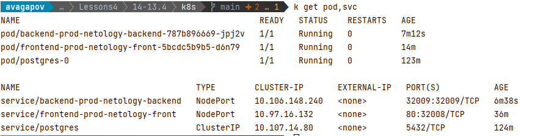

## [Домашнее задание к занятию "13.4 инструменты для упрощения написания конфигурационных файлов. Helm и Jsonnet"](https://github.com/netology-code/devkub-homeworks/blob/main/13-kubernetes-config-04-helm.md#%D0%B4%D0%BE%D0%BC%D0%B0%D1%88%D0%BD%D0%B5%D0%B5-%D0%B7%D0%B0%D0%B4%D0%B0%D0%BD%D0%B8%D0%B5-%D0%BA-%D0%B7%D0%B0%D0%BD%D1%8F%D1%82%D0%B8%D1%8E-134-%D0%B8%D0%BD%D1%81%D1%82%D1%80%D1%83%D0%BC%D0%B5%D0%BD%D1%82%D1%8B-%D0%B4%D0%BB%D1%8F-%D1%83%D0%BF%D1%80%D0%BE%D1%89%D0%B5%D0%BD%D0%B8%D1%8F-%D0%BD%D0%B0%D0%BF%D0%B8%D1%81%D0%B0%D0%BD%D0%B8%D1%8F-%D0%BA%D0%BE%D0%BD%D1%84%D0%B8%D0%B3%D1%83%D1%80%D0%B0%D1%86%D0%B8%D0%BE%D0%BD%D0%BD%D1%8B%D1%85-%D1%84%D0%B0%D0%B9%D0%BB%D0%BE%D0%B2-helm-%D0%B8-jsonnet)
## 

1. [Задание 1: подготовить helm чарт для приложения](https://github.com/netology-code/devkub-homeworks/blob/main/13-kubernetes-config-04-helm.md#%D0%B7%D0%B0%D0%B4%D0%B0%D0%BD%D0%B8%D0%B5-1-%D0%BF%D0%BE%D0%B4%D0%B3%D0%BE%D1%82%D0%BE%D0%B2%D0%B8%D1%82%D1%8C-helm-%D1%87%D0%B0%D1%80%D1%82-%D0%B4%D0%BB%D1%8F-%D0%BF%D1%80%D0%B8%D0%BB%D0%BE%D0%B6%D0%B5%D0%BD%D0%B8%D1%8F)

Подготовлены чарты для разных компонентов приложения, в директориях:
* k8s/frontend
* k8s/backend

Установка
```shell
helm install frontend frontend
helm install backend backend
```

Результат:  



2. [Задание 2: запустить 2 версии в разных неймспейсах](https://github.com/netology-code/devkub-homeworks/blob/main/13-kubernetes-config-04-helm.md#%D0%B7%D0%B0%D0%B4%D0%B0%D0%BD%D0%B8%D0%B5-2-%D0%B7%D0%B0%D0%BF%D1%83%D1%81%D1%82%D0%B8%D1%82%D1%8C-2-%D0%B2%D0%B5%D1%80%D1%81%D0%B8%D0%B8-%D0%B2-%D1%80%D0%B0%D0%B7%D0%BD%D1%8B%D1%85-%D0%BD%D0%B5%D0%B9%D0%BC%D1%81%D0%BF%D0%B5%D0%B9%D1%81%D0%B0%D1%85)

Создаем копии приложения в разных неймспейсах:
```shell
$ helm install backend backend --set service.port=32009 --set nameOverride=back1 -n app1
Release "backend" has been upgraded. Happy Helming!
$ helm install backend2 backend --set service.port=32109 --set nameOverride=back2 -n app1
Release "backend2" has been upgraded. Happy Helming!

$ k get pod -n app1
NAME                             READY   STATUS    RESTARTS   AGE
backend-back1-69fb45bb85-wm2l5   1/1     Running   0          33s
backend2-back2-b7588c65b-d7pnl   1/1     Running   0          9s

$ k create namespace app2
namespace/app2 created

$ helm install backend3 backend --set service.port=32209 --set nameOverride=back3 -n app2
Release "backend3" has been upgraded. Happy Helming!


$ k get pod -n app2
NAME                              READY   STATUS    RESTARTS   AGE
backend3-back3-68458c4566-gtzh6   1/1     Running   0          49s

```
