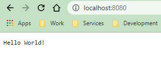

## [Домашнее задание к занятию "12.1 Компоненты Kubernetes"](https://github.com/netology-code/devkub-homeworks/blob/main/12-kubernetes-01-intro.md)
## 

1. [Задача 1: Установить Minikube](https://github.com/netology-code/devkub-homeworks/blob/main/12-kubernetes-01-intro.md#%D0%B7%D0%B0%D0%B4%D0%B0%D1%87%D0%B0-1-%D1%83%D1%81%D1%82%D0%B0%D0%BD%D0%BE%D0%B2%D0%B8%D1%82%D1%8C-minikube)
```shell
avagapov@kuber~$ minikube version
minikube version: v1.26.0
commit: f4b412861bb746be73053c9f6d2895f12cf78565
....
root@kuber:~# minikube status
minikube
type: Control Plane
host: Running
kubelet: Running
apiserver: Running
kubeconfig: Configured
.....
root@kuber:~# kubectl get pods --namespace=kube-system
NAME                            READY   STATUS    RESTARTS   AGE
coredns-6d4b75cb6d-v7sk9        1/1     Running   0          41s
etcd-kuber                      1/1     Running   0          55s
kube-apiserver-kuber            1/1     Running   0          56s
kube-controller-manager-kuber   1/1     Running   0          55s
kube-proxy-656v7                1/1     Running   0          42s
kube-scheduler-kuber            1/1     Running   0          56s
storage-provisioner             1/1     Running   0          53s
```

2. [Задача 2: Запуск Hello World](https://github.com/netology-code/devkub-homeworks/blob/main/12-kubernetes-01-intro.md#%D0%B7%D0%B0%D0%B4%D0%B0%D1%87%D0%B0-2-%D0%B7%D0%B0%D0%BF%D1%83%D1%81%D0%BA-hello-world)

```shell
root@kuber:/opt/app# minikube start --vm-driver=none --apiserver-ips=62.84.121.110
root@kuber:/opt/app# kubectl get services
NAME         TYPE           CLUSTER-IP      EXTERNAL-IP   PORT(S)          AGE
hello-node   LoadBalancer   10.104.241.99   <pending>     8080:32119/TCP   15s
kubernetes   ClusterIP      10.96.0.1       <none>        443/TCP          23m

root@kuber:/opt/app# minikube service hello-node
|-----------|------------|-------------|-------------------------|
| NAMESPACE |    NAME    | TARGET PORT |           URL           |
|-----------|------------|-------------|-------------------------|
| default   | hello-node |        8080 | http://10.28.1.21:32119 |
|-----------|------------|-------------|-------------------------|
🎉  Opening service default/hello-node in default browser...
👉  http://10.28.1.21:32119

root@kuber:/opt/app# curl http://127.0.0.1:32119
Hello World!
root@kuber:/opt/app# minikube addons enable ingress
    ▪ Using image k8s.gcr.io/ingress-nginx/controller:v1.2.1
    ▪ Using image k8s.gcr.io/ingress-nginx/kube-webhook-certgen:v1.1.1
    ▪ Using image k8s.gcr.io/ingress-nginx/kube-webhook-certgen:v1.1.1
🔎  Verifying ingress addon...

🌟  The 'ingress' addon is enabled

root@kuber:/opt/app# minikube addons enable dashboard
    ▪ Using image kubernetesui/dashboard:v2.6.0
    ▪ Using image kubernetesui/metrics-scraper:v1.0.8
💡  Some dashboard features require the metrics-server addon. To enable all features please run:

        minikube addons enable metrics-server


🌟  The 'dashboard' addon is enabled
```

3. [Задача 3: Установить kubectl](https://github.com/netology-code/devkub-homeworks/blob/main/12-kubernetes-01-intro.md#%D0%B7%D0%B0%D0%B4%D0%B0%D1%87%D0%B0-3-%D1%83%D1%81%D1%82%D0%B0%D0%BD%D0%BE%D0%B2%D0%B8%D1%82%D1%8C-kubectl)  

Для подключения к удаленному серверу с minikube, kubectl был установлен локально:
```shell
avagapov@local: kubectl version --client --output=yaml
clientVersion:
  buildDate: "2022-07-13T14:30:46Z"
  compiler: gc
  gitCommit: aef86a93758dc3cb2c658dd9657ab4ad4afc21cb
  gitTreeState: clean
  gitVersion: v1.24.3
  goVersion: go1.18.3
  major: "1"
  minor: "24"
  platform: linux/amd64
kustomizeVersion: v4.5.4
```
Создан конфиг ./kube/config. Скопированы на локальную машину ключ и сертификат для подключения. Установлен socat на машине с кубером.
```shell
apiVersion: v1
clusters:
- cluster:
    server: https://51.250.102.12:8443
  name: minikube
contexts:
- context:
    cluster: minikube
    user: minikube
  name: minikube
current-context: minikube
kind: Config
preferences: {}
users:
- name: minikube
  user:
    client-certificate: /home/avagapov/.kube/client.crt
    client-key: /home/avagapov/.kube/client.key
```

```shell
avagapov@local: kubectl --insecure-skip-tls-verify get pods
NAME                          READY   STATUS    RESTARTS   AGE
hello-node-5865956f4b-w5lfh   1/1     Running   0          33m
....
avagapov@local: kubectl --insecure-skip-tls-verify port-forward hello-node-5865956f4b-w5lfh 8080:8080
Forwarding from 127.0.0.1:8080 -> 8080
Forwarding from [::1]:8080 -> 8080
```

Проверяем локально:

```shell
avagapov@local: curl http://localhost:8080
Hello World!
```